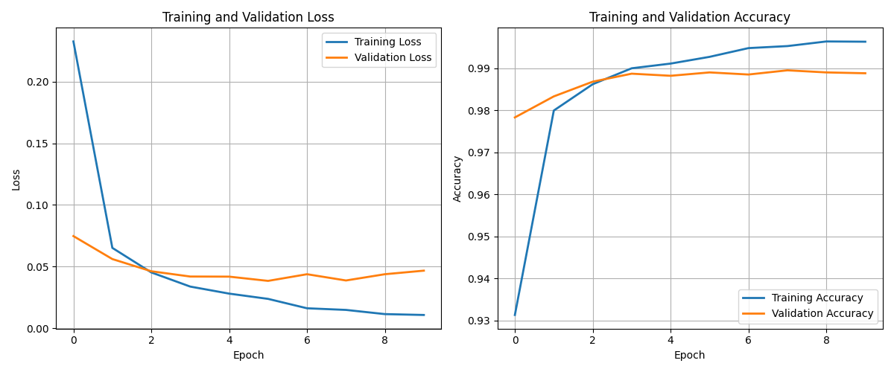
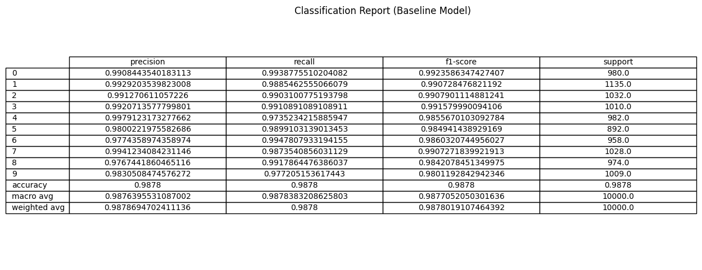
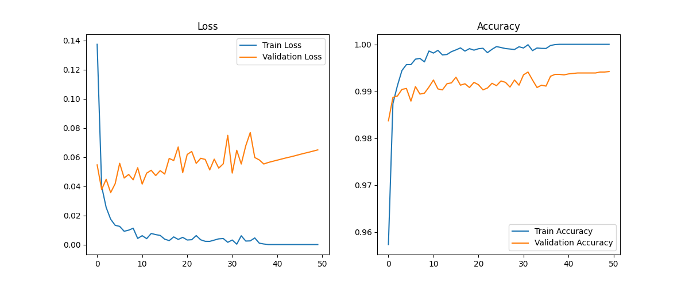
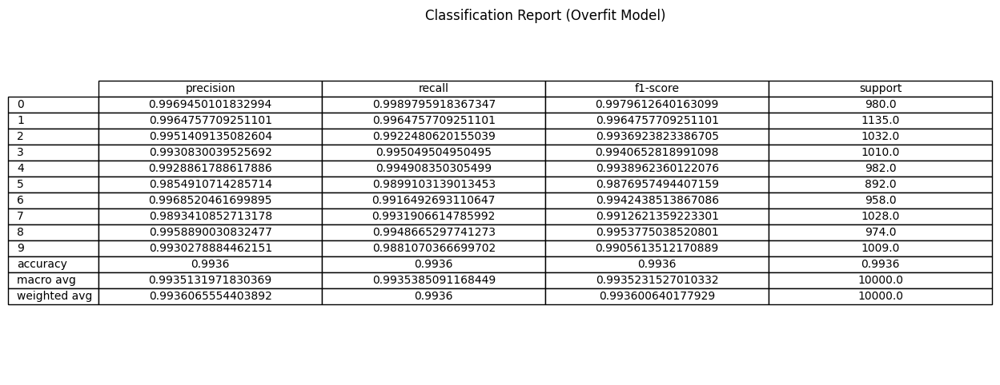
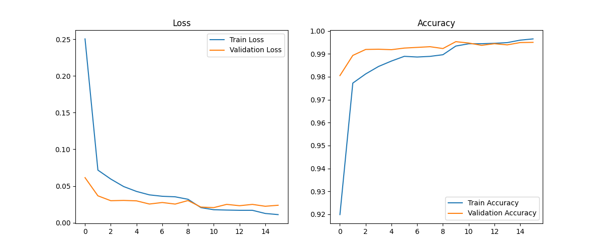
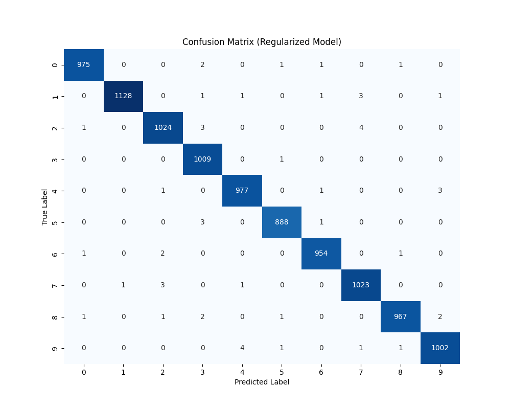
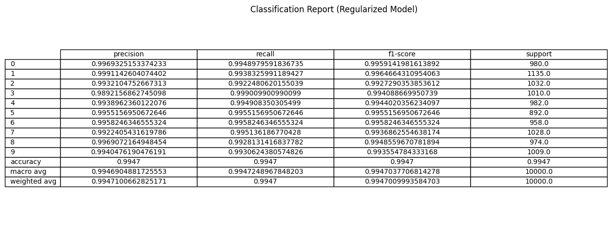

# MNIST Image Classification with Convolutional Neural Networks

This repository contains a comprehensive exploration of Convolutional Neural Networks (CNNs) for digit classification using the MNIST dataset. The project demonstrates the lifecycle of model training, including establishing a baseline, intentionally causing overfitting, and implementing regularization techniques to overcome it.

## Project Structure

The project is structured around three main experiments, which are also detailed in the accompanying LaTeX report:

### 1. Baseline CNN (Experiment 1)
A standard Convolutional Neural Network architecture designed to establish a performance baseline on the MNIST dataset. It uses a standard Train/Validation/Test split.

**Training Curves:**


**Confusion Matrix:**


**Classification Report:**


### 2. Overfitted CNN (Experiment 2)
The architecture from the baseline is modified to have significantly higher capacity (more filters, dense units, etc.) while keeping the dataset split the same. This model is trained without any regularization to intentionally demonstrate the phenomenon of overfitting, where the model memorizes the training data but fails to generalize to the validation set.

**Training Curves:**


**Confusion Matrix:**


**Classification Report:**


### 3. Regularized CNN (Experiment 3)
Using the *same* high-capacity architecture from Experiment 2, this phase introduces techniques to mitigate overfitting and improve generalization.

**Techniques used:**
*   **Data Augmentation:** Artificially increasing the diversity of the training set using `ImageDataGenerator`.
*   **AdamW Optimizer:** Decoupling weight decay from the gradient update for better regularization.
*   **Callbacks:** Utilizing `EarlyStopping` to halt training when validation performance degrades, and `ReduceLROnPlateau` to dynamically adjust the learning rate.

**Training Curves:**


**Confusion Matrix:**


**Classification Report:**



## Requirements

Ensure you have the following libraries installed:
*   TensorFlow / Keras
*   NumPy
*   Matplotlib
*   Pandas (if applicable)

You can install dependencies via pip:
```bash
pip install tensorflow numpy matplotlib pandas
```

